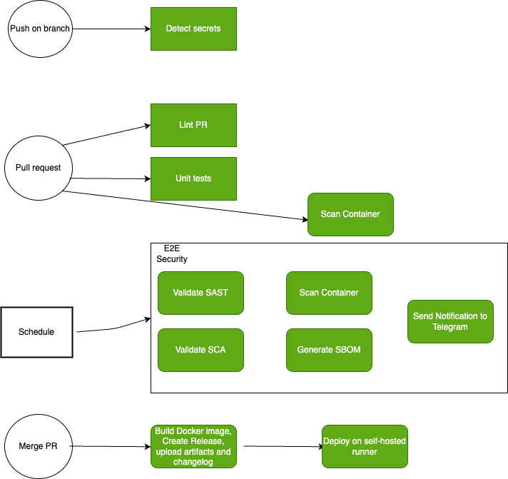

# budget-bot - A tiny tool to keep your money being tracked!
The idea of that is to create a small and user friendly budget tool to track your spends and incomes using a Telegram bot. 
Not sure at this moment if I'll continue development - maybe in free time.

## Purpose
The idea of this repository is to enable some automation skills to development cycle, to create, learn and maintain some best practices in CI/CD world. 
I'll be do my best on this field to be better IT specialist.

## Implemented scenarios
Below there are depicted few flows of how this repo reacts.

